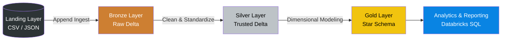
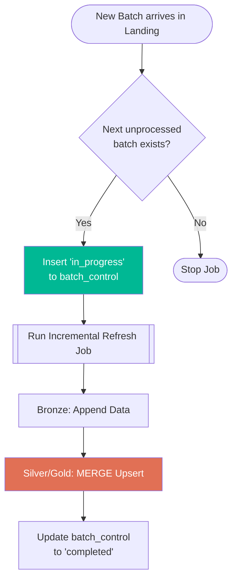

# 🏎️ Formula 1 Databricks Lakehouse Project

> An end-to-end data engineering and analytics project built on **Databricks**, **PySpark**, and **Delta Lake**.

## 📖 Project Overview
This project transforms raw Formula 1 motorsport data into a robust, reporting-ready data model using a modern **Lakehouse Architecture**. It evolves from a simple full-refresh pipeline into a highly scalable, **batch-based incremental processing pipeline** orchestrated by Lakeflow Jobs. 

**Key Business Goal:** Answer complex analytical questions like driver standings, constructor standings, and historical team dominance using reliable data pipelines.

---

## 🏗️ Architecture & Workflows

### 1. The Medallion Architecture
The data lifecycle flows through distinct layers, steadily increasing in structure and quality.

* **Landing**: Raw files exactly as received.
* **Bronze**: Raw data persisted in **Delta** format with metadata (ingestion timestamp, source file, batch ID).
* **Silver**: Deduplicated, standardized, and flattened "trusted" datasets.
* **Gold**: Dimensional model (`dim_races`, `dim_drivers`, `fact_session_results`) optimized for BI querying.

### 2. Incremental Batch Orchestration
To ensure production-level scalability, the project automates incremental data loads using a master orchestration job.

---

## 🚀 Important Technical Highlights

* **Delta Lake & ACID Transactions:** Uses `_delta_log` transaction logs to ensure consistent reads/writes and prevent failed jobs from corrupting the tables. 
* **Combined Fact Table:** Instead of splitting race and sprint results, they are combined into `fact_session_results` with a `session_type` flag for easier querying.
* **Master Orchestration:** Utilizes Databricks Lakeflow Jobs, Job Parameters (`p_batch_id`), and Task Values (`has_batch`) to dynamically trigger runs based on real-time control table logic.

---

## 🧗‍♂️ Challenges & Solutions

| Challenge | Solution |
| :--- | :--- |
| **Handling Diverse Data Formats** Source data includes simple CSVs, single-line JSON, partitioned JSON, and multi-line nested JSON. | Built dynamic PySpark ingestion notebooks with **explicit schema enforcement** and flattened nested structures inside the Silver layer. |
| **Compute Inefficiency** Full-refresh loading became too slow and expensive as historical data volume grew. | Implemented **Batch-Based Incremental Processing**. A `batch_control` table dynamically tracks folder drops, processing only the latest records. |
| **Duplicate Data Risks** Job reruns or failures risk inserting duplicate rows if pipelines blindly append data. | Utilized Delta Lake's **MERGE (Upsert) logic** in Silver and Gold layers. This ensures idempotency—meaning a job can safely rerun multiple times without duplicating business keys. |

---

## 🛠️ Getting Started

1. **Setup Environment**: Run the SQL scripts in `01-setup/` to create the Unity Catalog `formula1_incr` and its schemas (`landing`, `bronze`, `silver`, `gold`, `control`).
2. **Configure Variables**: Update storage paths in `00-common/01.environment-config.py`.
3. **Run Orchestration**: Execute the master notebook in `06-orchestration/` to evaluate Landing folders and trigger the incremental Databricks Lakeflow job.
