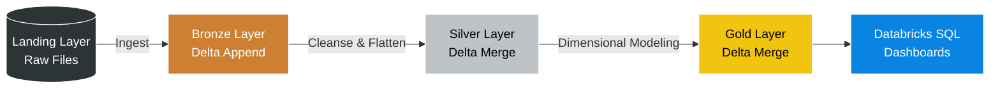
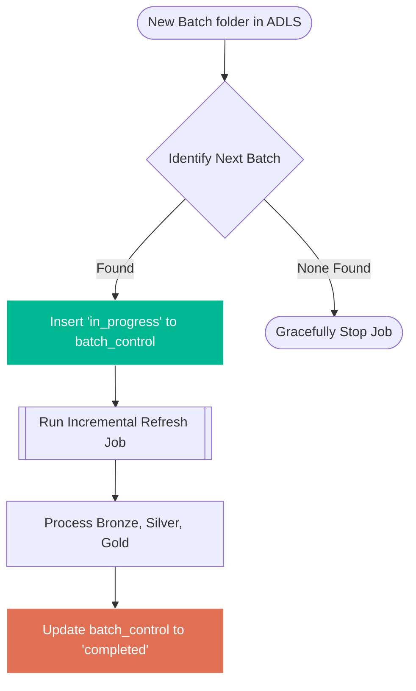

# 🏎️ Formula 1 Lakehouse: End-to-End Data Engineering on Databricks

Welcome to the **Formula 1 Lakehouse** project! This repository demonstrates a production-grade data engineering pipeline built entirely on **Databricks**, utilizing **PySpark**, **Delta Lake**, and **Unity Catalog**.

The project ingests raw Formula 1 motorsport data, processes it through a Medallion Architecture, and serves it for high-performance BI reporting. Most importantly, it evolves from a simple full-refresh pipeline into a robust, **incremental batch-processing system** orchestrated by Databricks Lakeflow Jobs.

---

## 🎯 Project Goals

### Business Objectives
- **Driver & Constructor Standings:** Accurately calculate season-level points and rankings.
- **Dominance Analysis:** Identify teams and drivers with long-term historical success.
- **Dashboard Readiness:** Provide clean, trusted datasets ready for Databricks SQL Dashboards and external BI tools.

### Technical Objectives
- Build a scalable **Medallion Architecture** (Bronze, Silver, Gold).
- Seamlessly handle multiple data formats (CSV, single-line JSON, multi-line nested JSON).
- Ensure data reliability using **Delta Lake ACID transactions**.
- Automate the workflow using **Lakeflow Jobs** with dynamic parameterization.
- Implement a custom **incremental load system** to process only new data and avoid costly full-table scans.

---

## ⚙️ The Data Pipeline Journey (Medallion Architecture)

The data lifecycle flows through distinct layers, steadily increasing in structure and quality.

### 1. Landing Layer (The Drop Zone)
Raw files arrive in Azure Data Lake Storage (ADLS). To support incremental processing, data is organized by batch folders (e.g., `landing/2025-01/`).

### 2. Bronze Layer (Raw Data Ingestion)
The first step of the Databricks pipeline. PySpark notebooks read the raw files, apply explicit schemas, and add essential audit metadata (like `ingestion_timestamp` and `batch_id`). Data is appended to Bronze Delta tables, preserving a full historical record of everything ingested.

### 3. Silver Layer (Cleansing & Standardization)
This layer acts as the "source of truth." We read from Bronze and perform transformations:
- **Standardizing column names** to `snake_case`.
- **Flattening nested JSON** structures (e.g., nested driver names).
- **Deduplication** and handling null keys.
- **Upserting (MERGE)** data into Silver tables to ensure idempotency.

### 4. Gold Layer (Dimensional Modeling)
The analytics-ready layer. We transform the normalized Silver data into a **Star Schema**:
- **Dimensions:** `dim_races`, `dim_drivers`, `dim_constructors`
- **Facts:** `fact_session_results` (Combining both Race and Sprint results into a single fact table with a `session_type` flag for easier querying).

---

## 🔄 Orchestration & Incremental Batch Processing

A major focus of this project was moving away from inefficient full-refresh loads to a smart, **incremental batch process**.

We built a custom `batch_control` table inside Unity Catalog. A **Master Orchestration Job** reads the Landing folder, compares it against the `batch_control` table, and passes the unprocessed `p_batch_id` as a parameter to the downstream data tasks. 

---

## 🚧 Detailed Challenges & Solutions

Building a production-grade data pipeline always comes with hurdles. Here is how we solved the biggest ones:

### 1. The "Format Soup" Challenge
**The Problem:** The Formula 1 dataset isn't uniform. Circuits and Races are simple CSVs. Constructors use single-line JSON. Drivers use nested JSON. Sprints are multi-line JSON. 
**The Solution:** Instead of relying heavily on `inferSchema` (which can break unexpectedly in production), we built robust PySpark ingestion notebooks with **explicit schema enforcement** for every file type. In the Silver layer, we used PySpark's `explode` and struct referencing to elegantly flatten nested JSON fields into clean, flat tabular columns.

### 2. The Compute Inefficiency of Full Refreshes
**The Problem:** In the early stages of the project, every pipeline run rebuilt the entire dataset from scratch. While fine for small datasets, this became a massive compute waste as historical data grew.
**The Solution:** We transitioned to an **Incremental Batch Processing** architecture. By structuring the landing zone into batch folders and creating a custom `batch_control` tracking table, our orchestration job now dynamically identifies and processes *only the newly arrived files*, cutting compute time and costs down drastically.

### 3. Preventing Duplicate Data (Idempotency)
**The Problem:** If a job fails halfway through, or if we need to safely rerun a specific batch, blindly appending data in the Silver and Gold layers would create duplicate rows and ruin downstream BI metrics.
**The Solution:** We leveraged Delta Lake's ACID compliance and **`MERGE` (Upsert) logic**. While Bronze remains append-only for audit purposes, Silver and Gold tables match incoming data on business keys. If a match exists, it updates; if not, it inserts. This makes the entire pipeline completely idempotent and safe to rerun.

### 4. Fragmented Fact Data
**The Problem:** Formula 1 has both main Races and Sprint Races. Originally, these might sit in different tables, forcing BI analysts to write complex `UNION` queries just to calculate a driver's total season points.
**The Solution:** We modeled a combined `fact_session_results` table in the Gold layer. By introducing a simple `session_type` flag (Race vs. Sprint), analysts can now easily aggregate total points or filter by session type on Databricks SQL dashboards using a single, unified fact table.

---

## 🛠️ Getting Started / Setup

To spin up this project in your own Databricks environment:

1. **Environment Setup:** 
   Execute the SQL scripts in `01-setup/` to create the Unity Catalog environment (`formula1_incr` catalog and `landing`, `bronze`, `silver`, `gold`, `control` schemas).
2. **Configure Paths:** 
   Update your specific Azure/AWS/GCP storage paths in the `00-common/01.environment-config.py` file.
3. **Trigger the Pipeline:** 
   Use the master orchestration notebook in `06-orchestration/` to evaluate your Landing folders, initialize the control tables, and trigger the incremental Databricks Lakeflow job.

---
*Built with ❤️ using PySpark, Delta Lake, and Databricks.*
